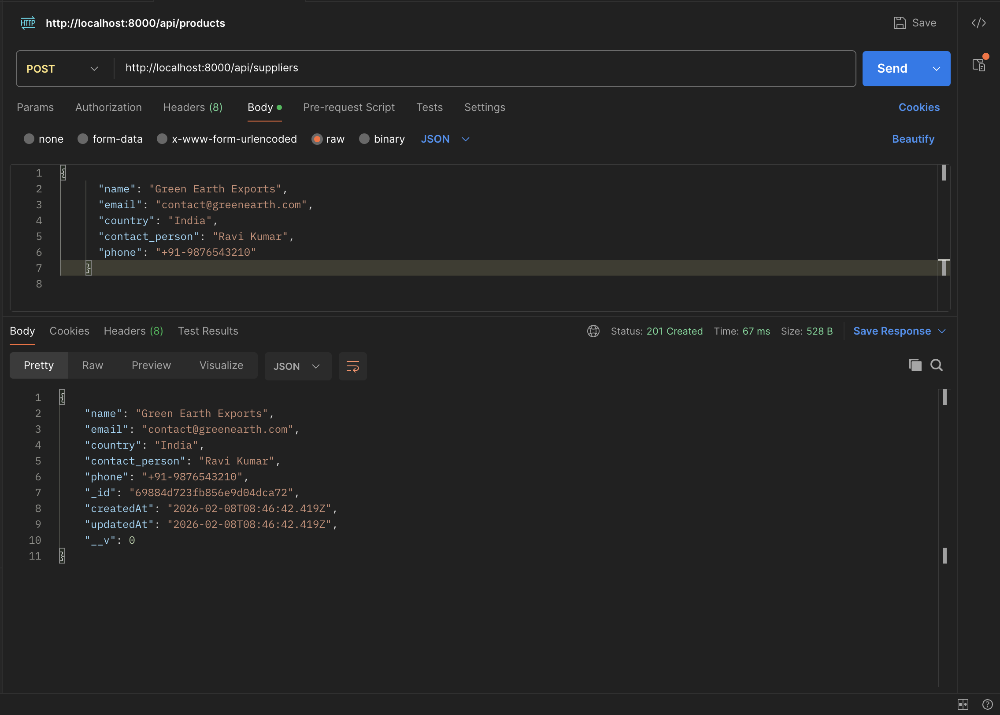
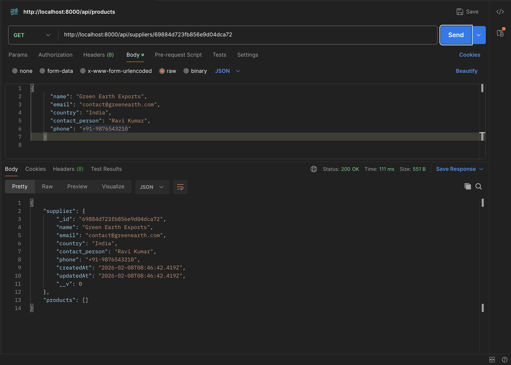
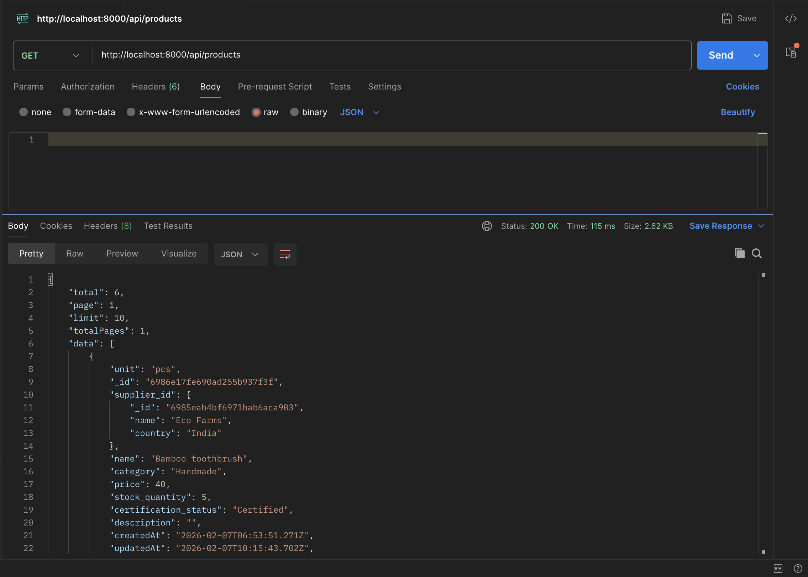
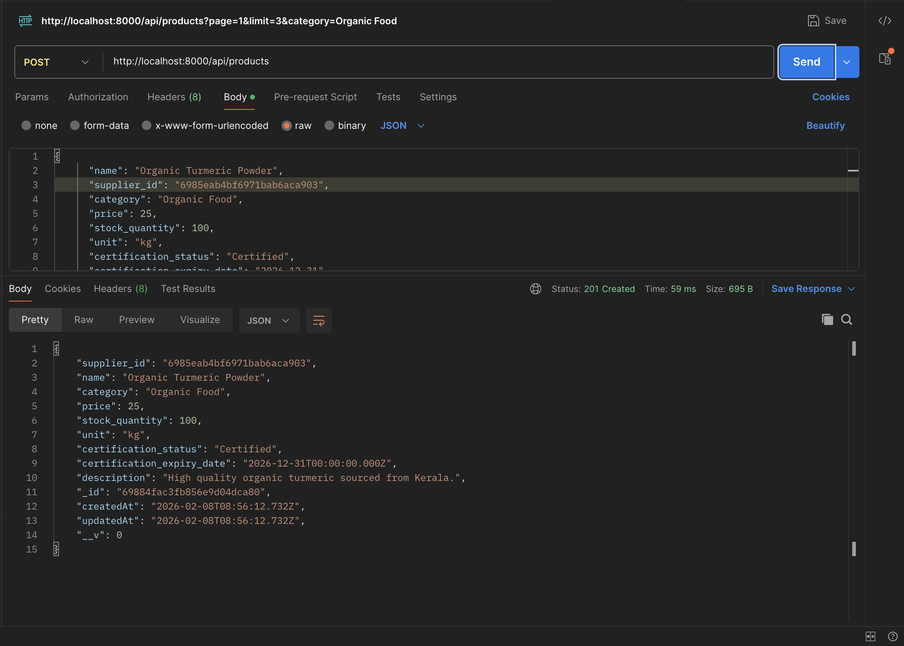
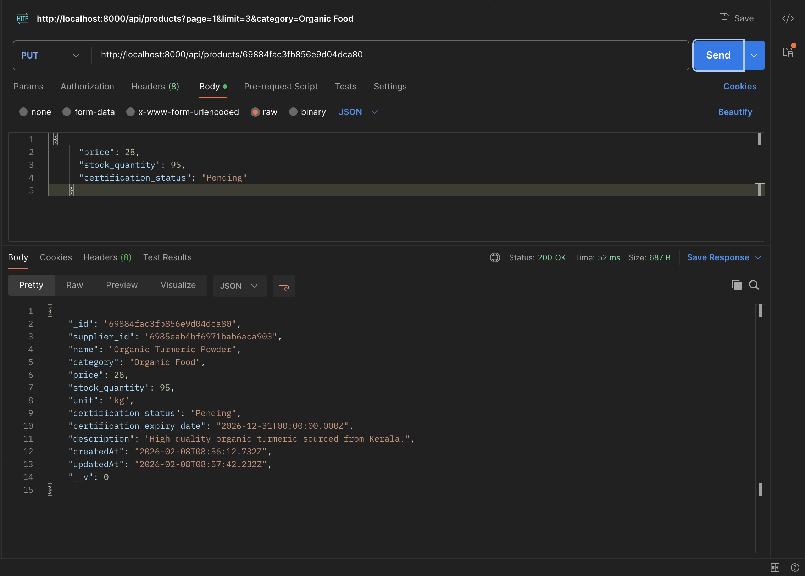
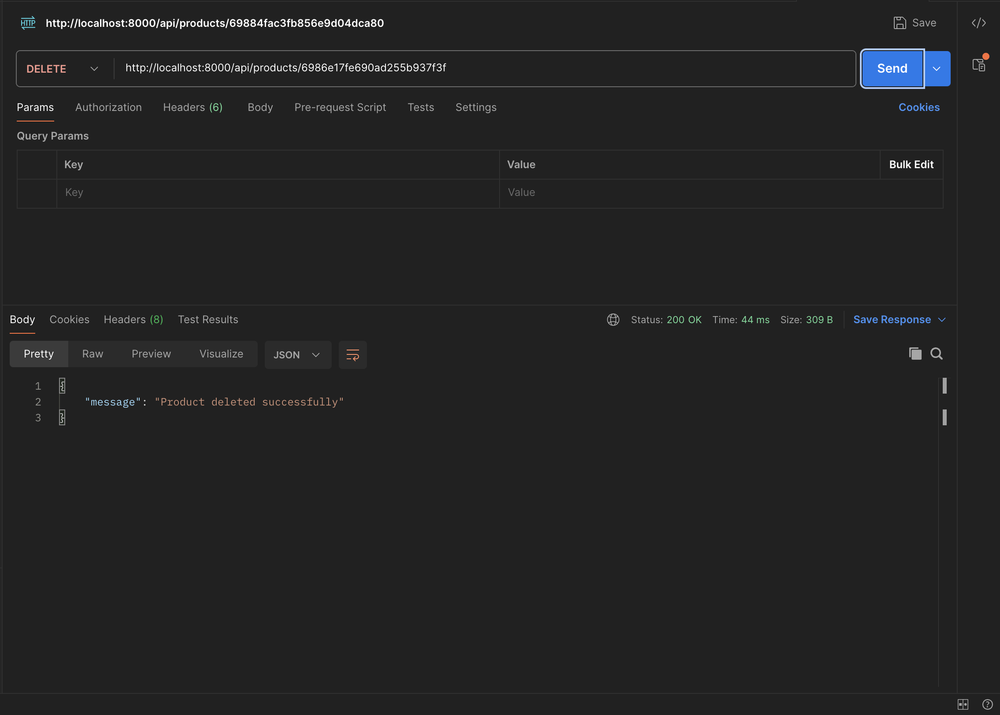
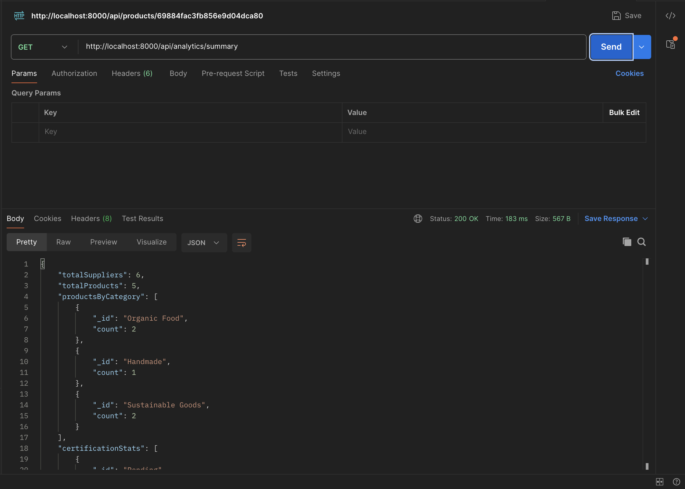

## API POSTMAN TESTING


**Base URL**: `http://localhost:8000`

---

## 1. Suppliers

### **GET All Suppliers**
*   **Method**: `GET`
*   **URL**: `{{base_url}}/api/suppliers`
*   **SCREENSHOT** 

### **ADD a New Supplier**
*   **Method**: `POST`
*   **URL**: `{{base_url}}/api/suppliers`
*   **Body** (Select `raw` -> `JSON`):
    ```json
    {
      "name": "Green Earth Exports",
      "email": "contact@greenearth.com",
      "country": "India",
      "contact_person": "Ravi Kumar",
      "phone": "+91-9876543210"
    }
    ```
     **SCREENSHOT** 

### **GET Supplier by ID**
*   **Method**: `GET`
*   **URL**: `{{base_url}}/api/suppliers/YOUR_SUPPLIER_ID_HERE`
     **SCREENSHOT** 
   

---

## 2. Products

### **GET All Products**
*   **Method**: `GET`
*   **URL**: `{{base_url}}/api/products`
    **SCREENSHOT** 

### **GET Products (With Pagination & Filters)**
*   **Method**: `GET`
*   **URL**: `{{base_url}}/api/products?page=1&limit=3&category=Organic Food`
    **SCREENSHOT** 

### **ADD a New Product**
*   **Method**: `POST`
*   **URL**: `{{base_url}}/api/products`
*   **Body** (JSON):
    ```json
    {
      "name": "Organic Turmeric Powder",
      "supplier_id": "YOUR_SUPPLIER_ID_HERE",  
      "category": "Organic Food",
      "price": 25,
      "stock_quantity": 100,
      "unit": "kg",
      "certification_status": "Certified",
      "certification_expiry_date": "2026-12-31",
      "description": "High quality organic turmeric sourced from Kerala."
    }
    ```
    **SCREENSHOT** 


### **UPDATE field (PUT)**
*   **Method**: `PUT`
*   **URL**: `{{base_url}}/api/products/YOUR_PRODUCT_ID_HERE`
*   **Body** (JSON):
    ```json
    {
      "price": 28,
      "stock_quantity": 95,
      "certification_status": "Pending"
    }
    ```
    **SCREENSHOT** 


### **DELETE Product**
*   **Method**: `DELETE`
*   **URL**: `{{base_url}}/api/products/YOUR_PRODUCT_ID_HERE`
    **SCREENSHOT** 

---

## 3. Analytics (Dashboard)

### **GET Dashboard Summary**
*   **Method**: `GET`
*   **URL**: `{{base_url}}/api/analytics/summary`
    **SCREENSHOT** 
