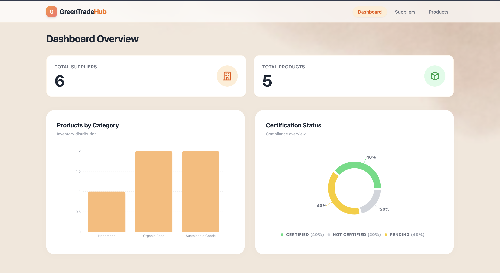
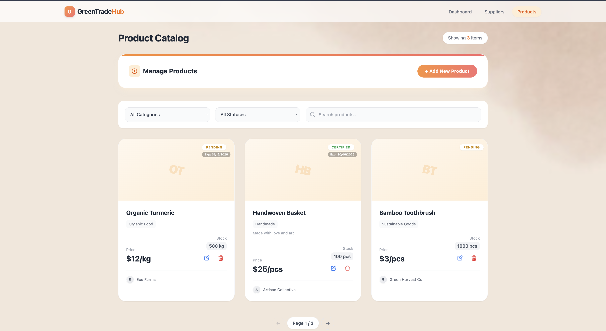
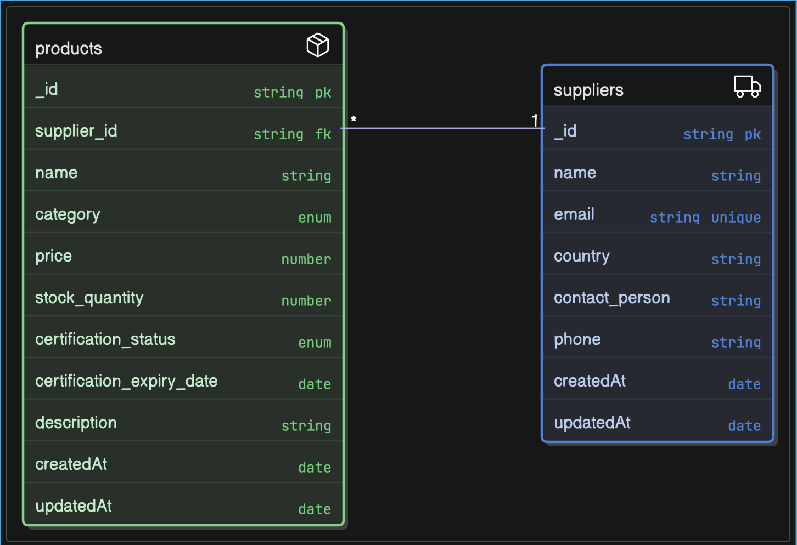

# Supplier & Product Management System
This is a full-stack web application I built for the technical assignment. It's a mini CRM and Marketplace system to manage suppliers and their products, complete with a dashboard for quick analytics.
The goal was to create something simple but functional, simulating how a real business might track their inventory and partners.

---
## Tech Stack

Here’s what I used to build it:

*   **Frontend**: React, Vite, Tailwind CSS
*   **Backend**: Node.js, Express
*   **Database**: MongoDB (using Mongoose for schemas)
*   **Deployment**: Vercel (Frontend) + Render (Backend)
*   **Tools**: Axios for API calls, Recharts for the dashboard

---

## Features

*   **Add Suppliers**: Create profiles for new suppliers with contact details.
*   **Add Products**: Link products to specific suppliers, including expiry dates for certifications.
*   **Search and Filter**: Find products by name, category, or certification status.
*   **Pagination**: Browse through products easily (I set it to 3 items per page for the demo).
*   **Status Update**: Track if a product is Certified, Pending, or Not Certified.
*   **Dashboard Overview**: See total counts and visual charts for inventory and compliance.

---

## Setup Instructions (Step-by-Step)

If you want to run this locally, here is how you do it:

### Frontend
```bash
git clone <repo-link>
cd frontend
npm install
npm run dev
```
The app should run on `localhost:5173`.

### Backend
1.  Open a new terminal.
2.  Go to the backend folder:
    ```bash
    cd backend
    ```
3.  Install dependencies:
    ```bash
    npm install
    ```
4.  Create a `.env` file in the `backend` folder and add your database URL:
    ```env
    MONGO_URI=your_mongodb_connection_string
    PORT=8000
    ```
5.  Start the server:
    ```bash
    npm start
    ```
The server will run on port `8000`.

---

## API Endpoints

These are the main routes I created:

*   `GET /api/suppliers` - Get all suppliers
*   `POST /api/suppliers` - Add a new supplier
*   `GET /api/products` - Get all products (with filters)
*   `POST /api/products` - Add a product
*   `PUT /api/products/:id` - Update a product
*   `DELETE /api/products/:id` - Remove a product
*   `GET /api/analytics/summary` - Data for the dashboard

---

## API Documentation (Postman)

I have tested all endpoints using Postman.
ALL THE SCREENSHOTS ARE ATTATCHED IN THE [API Documentation](API_DOCUMENTATION.md) file


---

## Screenshots Section

Here is what the app looks like:


*The main dashboard with charts.*


*Managing products with filters and pagination.*


*Form to add a new supplier.*

---

## Database Schema

I designed the database with two main models: **Supplier** and **Product**. A supplier can have multiple products.



---

## Live Demo Links

*   **Frontend Live**: https://mini-supplier-product-management-sy.vercel.app/
*   **Backend Live**: https://mini-supplier-product-management-system.onrender.com/

---
> **Note:** Backend may take up to a minute to start on first load (Render free tier sleep mode).


## Assumptions / Design Decisions

*   **Functionality First**: I focused more on making sure the data flows correctly before making it look pretty, though I did add some nice UI touches at the end.
*   **Simple UI**: I used a clean, "soft" design with Tailwind because it's easier to read and looks modern.
*   **Small Scale**: I assumed this is for internal use, so I didn't add complex user roles or permissions yet.
*   **Readable Code**: I tried to keep the code structure organized (controllers, models, routes) so it's easy to understand.

---

## Conclusion

This project helped me understand the full-stack flow much better, especially how to connect the frontend charts to the backend analytics API. I enjoyed building it!
